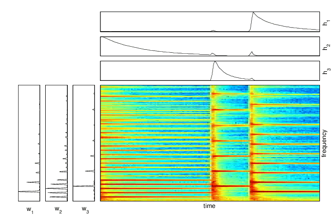
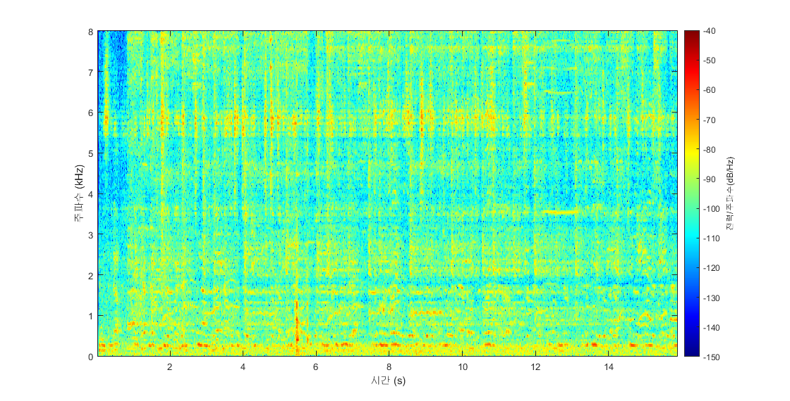
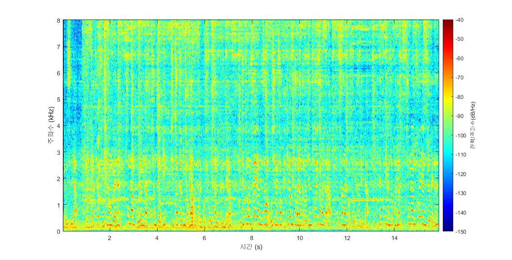

# RT_ILRMA_RLS

---

# **BSS(Blind Source Separation)**

서강대 전자공학과 박형민 교수님 연구실에서 제작한 octa capture microphone을 사용한 실시간 입출력 처리 모듈이며, 여러 화자가 동시에 발화하는 다채널 음원 신호를 입력으로 해당 알고리즘이 예측한 음원 분리 결과를 실시간으로 std out 출력하거나 혹은 wav파일을 반환 합니다.

## **IVA(Independent Vector Analysis)**

여러 독립적인 신호가 뒤섞인 음원에 대해서 각 출력 채널이 최대한 독립적인 신호로 구성되도록 분리하는 알고리즘입니다.

1. 정상적으로 음원이 분리가 되기 위해서는 입력 마이크 채널의 개수보다 음원의 개수가 더 적어야 합니다.
2. 어떤 음원이 몇 번째 출력 채널로 분리되어 나올지 알 수 없습니다.

## **NMF(Non-negative Marix Factorization)**

어떤 비음수로만 구성된 행렬에 대해서 이를 rank수 만큼의 열과 행에 대한 bases로 분석하는 알고리즘입니다. 예를 들어 아래와 같이 어떤 Spectrogram이 주어지면, 이를 주파수 축으로 어떻게 표현되는지를 나타내는 basis **w**와 프레임(시간) 축으로 언제 표현되는지를 나타내는 activation **h**으로 지정한 rank=3개 만큼으로 분석합니다.




## **ILRMA(Independent Low-rank Matrix Analysis)**

IVA와 NMF를 결합한 알고리즘으로, 여러 독립적인 신호가 모두 low-rank의 spectrogram을 가지고 있다고 가정하고 이를 NMF로 분석합니다. 이를 통해 IVA보다 좀 더 정확한 source model를 설계하여 더 높은 분리 성능을 보여줍니다.


## Prerequisite

이는 옥타 캡처 보드 입력을 기반으로 제작된 코드로 이를 위해서는 옥타 캡처 보드 입력과 이에 맞는 소프트웨어가 설치되어야 합니다.

[The RtAudio Home Page](https://www.music.mcgill.ca/~gary/rtaudio/)

## Setting Parameter in AUXIVA_ICD_Online.h

```cpp
#define Nch			2
#define nWin		1024
#define BufferSize		256
#define SamplingFreq    16000
```

- `Nch` 은 설정하고자 하는 채널의 개수를 의미하며, 입력 채널의 개수와 동일해야 합니다. 위와 같이 두개의 마이크로 입력된 경우 2로 설정합니다.
- `nWin` 은 short time fourier transform(STFT) 에서 매 프레임 fast fourier transform(FFT)를 진행하기 위한 윈도우 샘플의 개수를 의미합니다. 이는 2의 거듭제곱 수로 설정하며 일반적으로 512~4096내에서 tuning을 진행할 수 있습니다.
- `BufferSize` 는 매 프레임 새로 들어오는 샘플의 개수를 말하며, 매 프레임은 전체 윈도우 샘플의 1/4간격으로 움직이기 때문에 nWin의 1/4값으로 설정 해줍니다.
- `SamplingFreq` 는 입력할 wav 파일의 샘플링 주파수로 설정 해줍니다.

## Setting Option in ProcBuffers.h

```cpp
#define MAKE_FILE		1			//option 1 : wav 저장 (IVA출력 + 입력원본)		2: strout 출력(IVA출력)		3: strout 출력 (IVA출력 + 입력 원본)
```

- `MAKE_FILE`  line-out외에도 추가적으로 wav를 저장할지, 커맨드라인으로 출력할지를 선택하는 옵션입니다.

## Build

x64로 빌드를 진행합니다.

## Execution

wav 저장 시에, 입력 및 출력 파일은 각각 input과 output 폴더 내부에 저장됩니다. **input, output 디렉토리가 없으면 오류가 발생합니다.**

- **샘플 입력 저장 결과**
샘플 입력은 input디렉토리에 포함되어있습니다.

**input1.wav**

**input2.wav**


**첫번째 채널에 대한 스펙트로그램**


- **샘플 출력 저장 결과**
샘플 출력은 output디렉토리에 포함되어있습니다.

**IVA_ch1.wav**



**IVA_ch2.wav**


